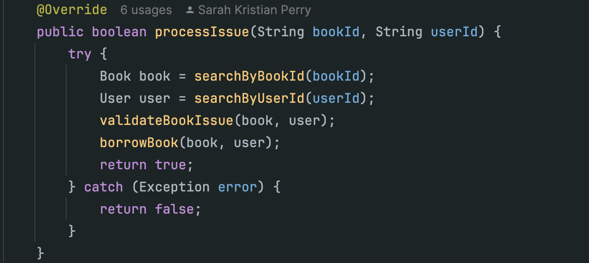
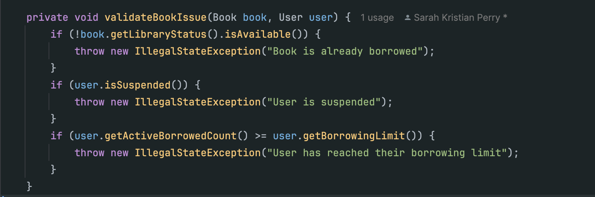
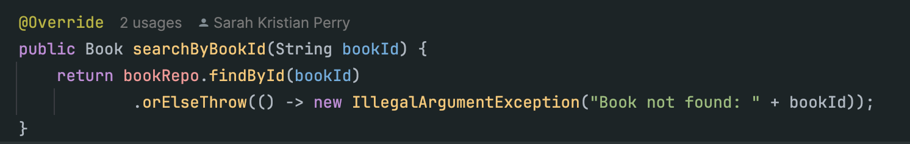
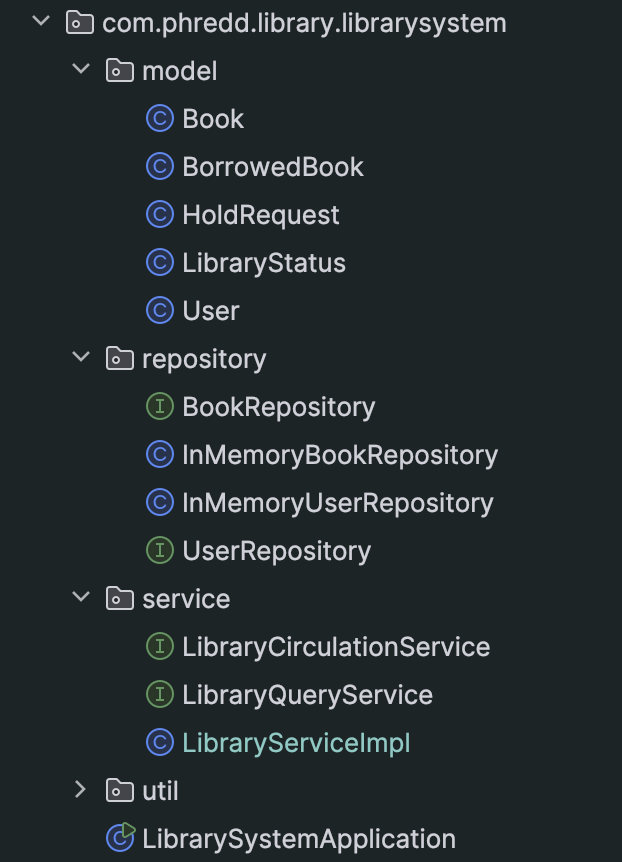
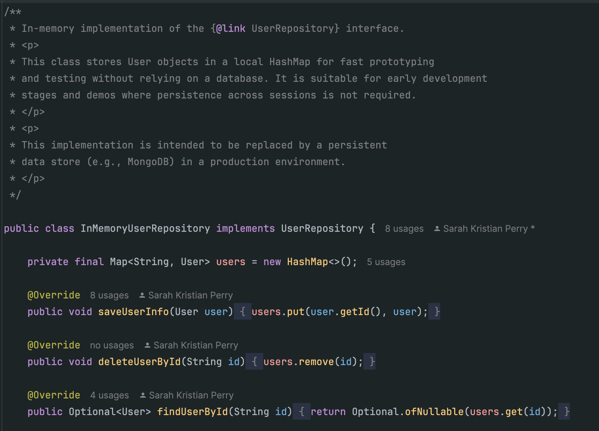
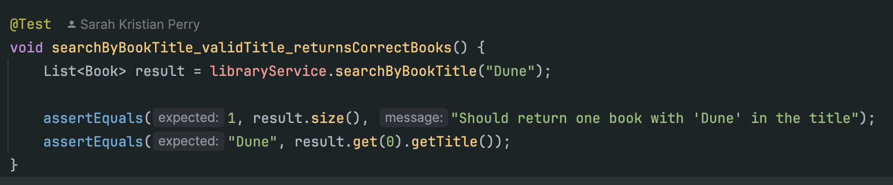
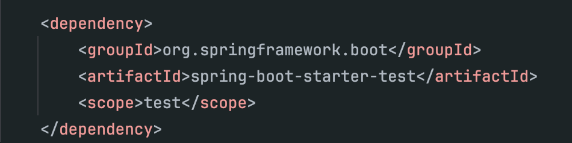

# Library Management System

## 1. Project Overview

### What It Does
This Java CLI-based Library Management System allows users to:
- Search for books by title or author
- Issue and return books
- Track current and historical borrows
- Enforce borrowing limits
- Print formatted book and borrow tables

### How It Works
- Data is stored in memory using simple repository classes backed by HashMaps
- A `LibraryServiceImpl` class coordinates logic between users and books
- Borrowed book data is modeled separately to include borrow date, due date, and return status
- Note that no GUI or CLI interface has yet been implemented

### Test Coverage
JUnit 5 tests cover both positive and negative cases:
- Successful and failed book borrowing
- Search by book title
- Handling missing books and users
- Enforcing borrow limits

## 2. Clean Code Practices Followed
This project was designed with Clean Code principles in mind, focusing on clarity, simplicity, and maintainability. Key practices include:

### 1. Clear Function Design
- KISS: Functions are concise and single-purpose — like `processIssue()` or `validateBookIssue()`.
  

    

- DRY: Shared logic like `searchByBookId()` avoids repetition across methods.
     
- Descriptive names: Methods and variables like `getUserBorrowHistory`, `borrowBook`, and `isReturned` clearly communicate intent.

### 2. Separation of Concerns
- Logic is split between:
    - Models (Book, User, etc.)
    - Repositories (`InMemoryBookRepository`, `InMemoryUserRepository`)
    - Services (`LibraryServiceImpl`)
    - Tests (`LibraryServiceImplTest`)
- Each class has one clear responsibility.

### 3. Consistent Naming and Readability
- Classes, variables, and methods follow consistent, readable naming conventions.
- Indentation and vertical spacing make related code easy to follow.
- Avoids “magic numbers” and excessive comments by making code self-explanatory.

    

### 4. Testable and Tested Code
- Core service methods are unit tested using JUnit 5.
- Tests are readable, isolated, and check both success and failure paths.
- Logical test method names describe what they check (`processIssue_userMaxBorrowLimit_returnsFalse`).

    

## 3. Maven Dependencies

All dependencies were declared in pom.xml and managed using Maven. The most important ones:

- Spring Boot Starter: Basic app structure
- Spring Boot Starter Test (JUnit 5): Unit testing
- Spring Boot: (in anticipating of adding API functionality)
- GitHub Actions Workflow: Set up via `.github/workflows/maven.yml` to run tests on push and PR

    

## 4. Challenges & Resolutions
### Organizing Classes to Separate Concerns
It was difficult to decide when to split functionality into separate services or interfaces, and when to keep things unified. For example, I debated whether to separate the logic in `LibraryServiceImpl` into multiple services (`UserManagementService`, `BookManagementService`, `BorrowingService`, etc.) or keep it as one class with clear internal sections.
I eventually chose to split responsibilities using two interfaces:
- `LibraryQueryService`
- `LibraryCirculationService`
This allowed me to maintain a single implementation class (`LibraryServiceImpl`) while still keeping the contract clean and modular.

### Stream Syntax
Although using Java Streams helped to write more concise code, the syntax took some getting used to — especially when filtering or matching on object fields.
